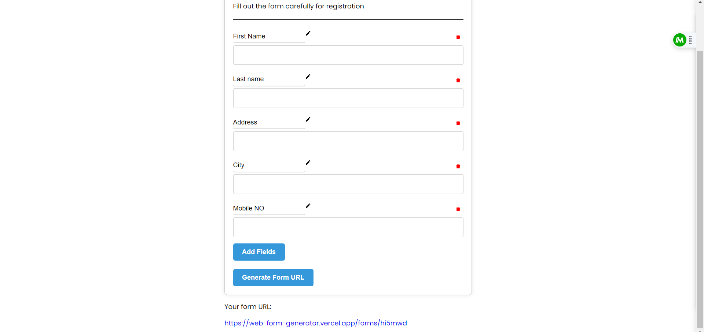
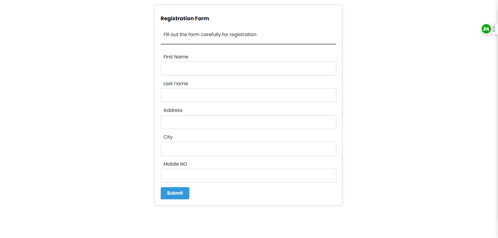
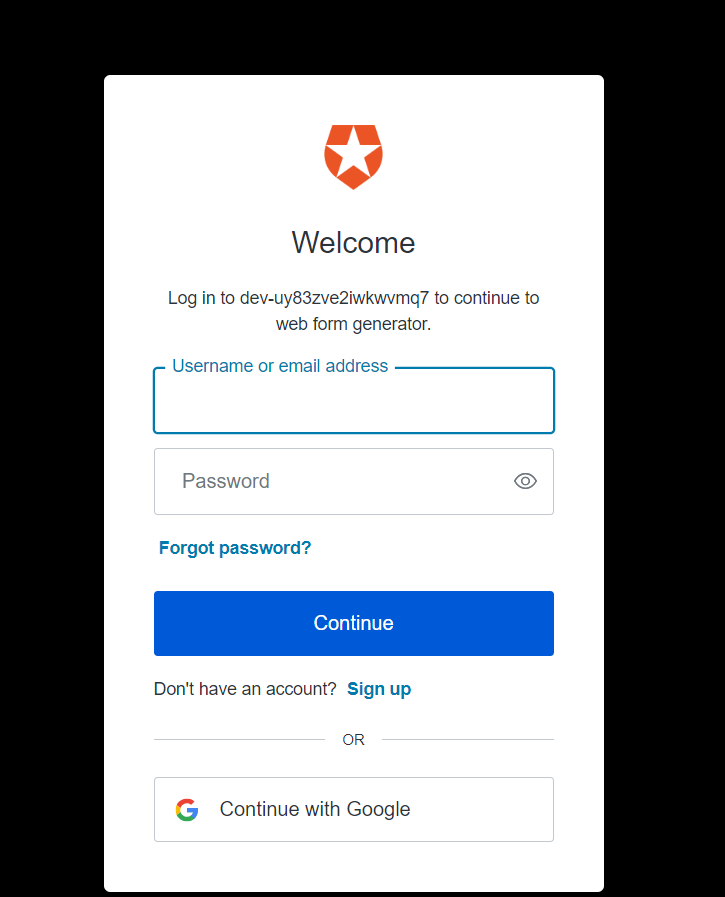
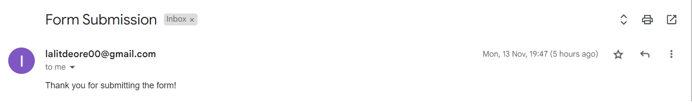

# Web Form Generator

Web Form Generator is a React application that allows users to create dynamic forms, generate unique form URLs, and collect submissions.

**Deployment Link: [Your Deployment Link Here](https://web-form-generator.vercel.app/)**

## Features

- **Dynamic Form Creation:** Easily add and customize form fields.
- **Form URL Generation:** Generate unique URLs for each form.
- **Submission Handling:** Collect and handle form submissions.
- **User Authentication:** Allow authenticated users to access and submit forms.

## Technologies Used

- React
- React Router
- Auth0 for Authentication
- Axios for HTTP requests
- CSS for styling

This is the home page. Here, users can add, edit, and delete fields. When the user clicks on "Generate URL," a unique URL is generated.

When a user visits the form page, the generated form link is checked. If the user is not logged in, they are prompted to log in using Auth0. Once logged in, the user can fill out the form. After submitting the form, an email will be sent to the user's login email ID.

Users can log in using their Gmail account or email ID and password.

